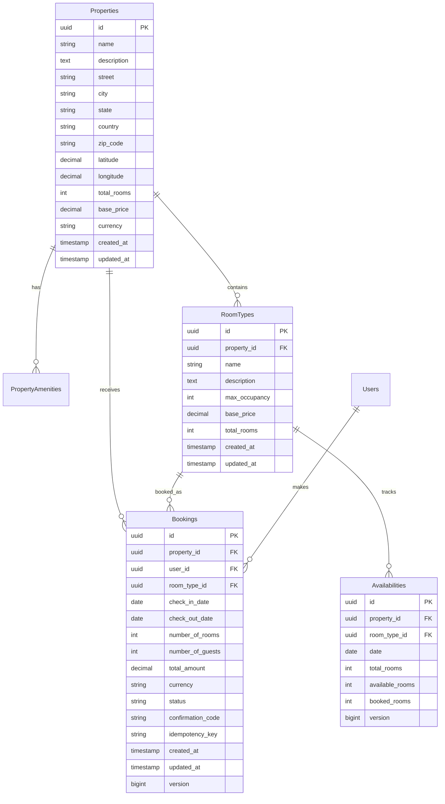

# Database Schema Reference

## Entity Relationship Diagram



## Table Definitions

### Properties
```sql
CREATE TABLE properties (
    id UUID PRIMARY KEY DEFAULT uuid_generate_v4(),
    name VARCHAR(255) NOT NULL,
    description TEXT,
    street VARCHAR(255),
    city VARCHAR(100),
    state VARCHAR(100),
    country VARCHAR(100),
    zip_code VARCHAR(20),
    latitude DOUBLE PRECISION,
    longitude DOUBLE PRECISION,
    total_rooms INTEGER,
    base_price DECIMAL(10,2),
    currency VARCHAR(3) DEFAULT 'USD',
    created_at TIMESTAMP NOT NULL DEFAULT CURRENT_TIMESTAMP,
    updated_at TIMESTAMP NOT NULL DEFAULT CURRENT_TIMESTAMP
);

-- Indexes
CREATE INDEX idx_properties_city ON properties(city);
CREATE INDEX idx_properties_location ON properties(latitude, longitude);

-- Triggers
CREATE TRIGGER update_properties_updated_at 
    BEFORE UPDATE ON properties 
    FOR EACH ROW EXECUTE FUNCTION update_updated_at_column();
```

### Bookings
```sql
CREATE TABLE bookings (
    id UUID PRIMARY KEY DEFAULT uuid_generate_v4(),
    property_id UUID NOT NULL,
    user_id UUID NOT NULL,
    room_type_id UUID,
    check_in_date DATE NOT NULL,
    check_out_date DATE NOT NULL,
    number_of_rooms INTEGER NOT NULL,
    number_of_guests INTEGER NOT NULL,
    total_amount DECIMAL(10,2) NOT NULL,
    currency VARCHAR(3) NOT NULL DEFAULT 'USD',
    status VARCHAR(50) NOT NULL DEFAULT 'PENDING',
    payment_id VARCHAR(255),
    special_requests TEXT,
    confirmation_code VARCHAR(50) UNIQUE NOT NULL,
    idempotency_key VARCHAR(255) UNIQUE,
    cancellation_reason TEXT,
    refund_amount DECIMAL(10,2),
    created_at TIMESTAMP NOT NULL DEFAULT CURRENT_TIMESTAMP,
    updated_at TIMESTAMP NOT NULL DEFAULT CURRENT_TIMESTAMP,
    cancelled_at TIMESTAMP,
    version BIGINT DEFAULT 0,
    
    -- Constraints
    CONSTRAINT bookings_number_of_guests_check CHECK (number_of_guests > 0),
    CONSTRAINT bookings_number_of_rooms_check CHECK (number_of_rooms > 0),
    CONSTRAINT bookings_total_amount_check CHECK (total_amount >= 0)
);

-- Indexes
CREATE INDEX idx_bookings_property_id ON bookings(property_id);
CREATE INDEX idx_bookings_user_id ON bookings(user_id);
CREATE INDEX idx_bookings_room_type_id ON bookings(room_type_id);
CREATE INDEX idx_bookings_check_in_date ON bookings(check_in_date);
CREATE INDEX idx_bookings_status ON bookings(status);
CREATE INDEX idx_bookings_created_at ON bookings(created_at);
CREATE UNIQUE INDEX idx_idempotency_key ON bookings(idempotency_key);

-- Composite indexes for performance
CREATE INDEX idx_bookings_compound ON bookings(property_id, status, created_at);
```

### Room Types
```sql
CREATE TABLE room_types (
    id UUID PRIMARY KEY DEFAULT uuid_generate_v4(),
    property_id UUID NOT NULL,
    name VARCHAR(255) NOT NULL,
    description TEXT,
    max_occupancy INTEGER NOT NULL,
    base_price DECIMAL(10,2) NOT NULL,
    total_rooms INTEGER NOT NULL,
    created_at TIMESTAMP NOT NULL DEFAULT CURRENT_TIMESTAMP,
    updated_at TIMESTAMP NOT NULL DEFAULT CURRENT_TIMESTAMP,
    
    -- Constraints
    CONSTRAINT room_types_max_occupancy_check CHECK (max_occupancy > 0),
    CONSTRAINT room_types_base_price_check CHECK (base_price >= 0),
    CONSTRAINT room_types_total_rooms_check CHECK (total_rooms >= 0)
);

-- Indexes
CREATE INDEX idx_room_types_property_id ON room_types(property_id);
```

### Availabilities
```sql
CREATE TABLE availabilities (
    id UUID PRIMARY KEY DEFAULT uuid_generate_v4(),
    property_id UUID NOT NULL,
    room_type_id UUID NOT NULL,
    date DATE NOT NULL,
    total_rooms INTEGER NOT NULL,
    available_rooms INTEGER NOT NULL,
    booked_rooms INTEGER NOT NULL DEFAULT 0,
    version BIGINT DEFAULT 0,
    
    -- Constraints
    CONSTRAINT availabilities_available_rooms_check CHECK (available_rooms >= 0),
    CONSTRAINT availabilities_booked_rooms_check CHECK (booked_rooms >= 0),
    CONSTRAINT availabilities_total_rooms_check CHECK (total_rooms >= 0),
    CONSTRAINT chk_room_consistency CHECK (available_rooms + booked_rooms = total_rooms),
    CONSTRAINT uk_availability_property_room_date UNIQUE (property_id, room_type_id, date)
);

-- Indexes
CREATE INDEX idx_availability_property_date ON availabilities(property_id, date);
CREATE INDEX idx_availability_room_type_date ON availabilities(room_type_id, date);
CREATE INDEX idx_available_rooms ON availabilities(available_rooms);
```

### Users
```sql
CREATE TABLE users (
    id UUID PRIMARY KEY DEFAULT uuid_generate_v4(),
    email VARCHAR(255) NOT NULL UNIQUE,
    first_name VARCHAR(100),
    last_name VARCHAR(100),
    phone VARCHAR(20),
    status VARCHAR(20) DEFAULT 'ACTIVE',
    created_at TIMESTAMP NOT NULL DEFAULT CURRENT_TIMESTAMP,
    updated_at TIMESTAMP NOT NULL DEFAULT CURRENT_TIMESTAMP
);

-- Indexes
CREATE INDEX idx_users_email ON users(email);
CREATE INDEX idx_users_status ON users(status);
```

### Property Amenities (Junction Table)
```sql
CREATE TABLE property_amenities (
    property_id UUID NOT NULL,
    amenity VARCHAR(255) NOT NULL,
    PRIMARY KEY (property_id, amenity),
    FOREIGN KEY (property_id) REFERENCES properties(id) ON DELETE CASCADE
);
```

## Common Query Patterns

### Property Search
```sql
-- Search by location
SELECT * FROM properties 
WHERE city = ? AND country = ?;

-- Nearby properties (Haversine formula)
SELECT * FROM properties p WHERE 
(6371 * acos(
  cos(radians(?)) * cos(radians(p.latitude)) * 
  cos(radians(p.longitude) - radians(?)) + 
  sin(radians(?)) * sin(radians(p.latitude))
)) <= ?;
```

### Availability Checking
```sql
-- Check room availability for date range
SELECT MIN(available_rooms) as min_available
FROM availabilities 
WHERE property_id = ? 
  AND room_type_id = ? 
  AND date BETWEEN ? AND ?;

-- Update availability (with optimistic locking)
UPDATE availabilities 
SET available_rooms = available_rooms - ?,
    booked_rooms = booked_rooms + ?,
    version = version + 1
WHERE property_id = ? 
  AND room_type_id = ?
  AND date BETWEEN ? AND ?
  AND version = ?;
```

### Booking Queries
```sql
-- User's recent bookings
SELECT b.*, p.name as property_name, rt.name as room_name
FROM bookings b
JOIN properties p ON b.property_id = p.id
LEFT JOIN room_types rt ON b.room_type_id = rt.id
WHERE b.user_id = ?
ORDER BY b.created_at DESC;

-- Overlapping bookings check
SELECT COUNT(*) FROM bookings 
WHERE property_id = ?
  AND room_type_id = ?
  AND status IN ('CONFIRMED', 'PENDING')
  AND (check_in_date <= ? AND check_out_date >= ?);
```

## Database Functions & Triggers

### Update Timestamp Function
```sql
CREATE OR REPLACE FUNCTION update_updated_at_column()
RETURNS TRIGGER AS $$
BEGIN
    NEW.updated_at = CURRENT_TIMESTAMP;
    RETURN NEW;
END;
$$ language 'plpgsql';
```

### Auto-Generate Confirmation Codes
```sql
-- Applied in application layer, but could be DB function:
CREATE OR REPLACE FUNCTION generate_confirmation_code()
RETURNS VARCHAR(50) AS $$
BEGIN
    RETURN 'BK' || EXTRACT(EPOCH FROM NOW())::bigint || 
           LPAD((RANDOM() * 999)::int::text, 3, '0');
END;
$$ LANGUAGE plpgsql;
```

## Performance Considerations

### Critical Indexes
```sql
-- For booking search performance
CREATE INDEX idx_bookings_dates_status ON bookings(check_in_date, check_out_date, status);

-- For availability lookups
CREATE INDEX idx_availability_lookup ON availabilities(property_id, room_type_id, date, available_rooms);

-- For property search
CREATE INDEX idx_properties_search ON properties(city, country, base_price);
```

### Query Optimization Tips
1. **Always use indexes** on foreign keys
2. **Composite indexes** for multi-column WHERE clauses
3. **Partial indexes** for status-based queries
4. **VACUUM ANALYZE** regularly for fresh statistics
5. **Connection pooling** to limit concurrent connections

## Data Integrity Rules

### Business Constraints
- `number_of_guests > 0` - Must have at least one guest
- `number_of_rooms > 0` - Must book at least one room  
- `total_amount >= 0` - Cannot have negative amounts
- `available_rooms + booked_rooms = total_rooms` - Room accounting
- `check_out_date > check_in_date` - Valid date ranges

### Referential Integrity
- All bookings must reference valid properties and users
- Room types must belong to existing properties
- Availabilities must reference valid room types
- Soft delete patterns preserve historical data

---

*Last updated: December 2024*